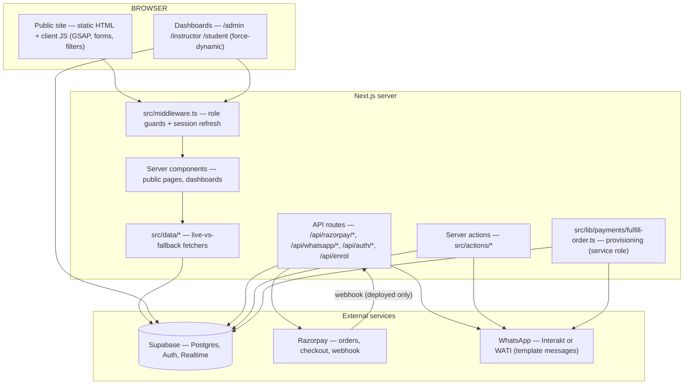
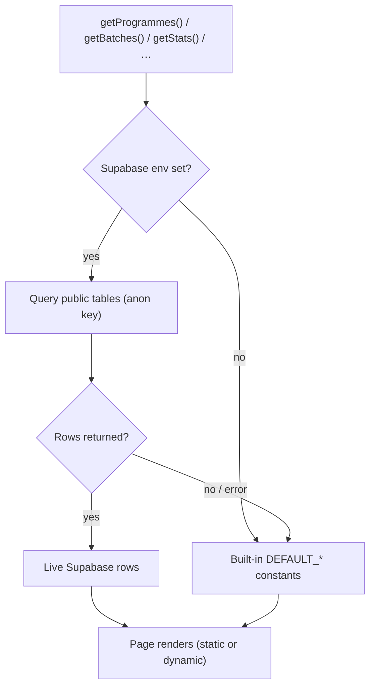
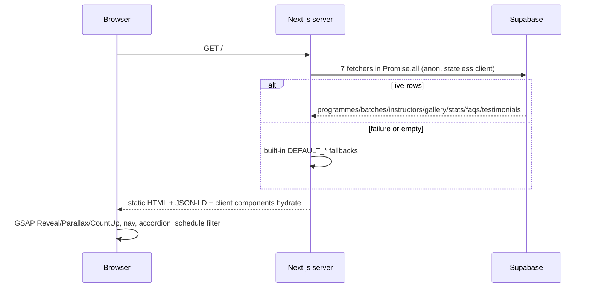
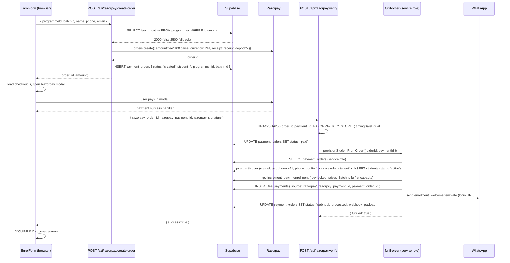
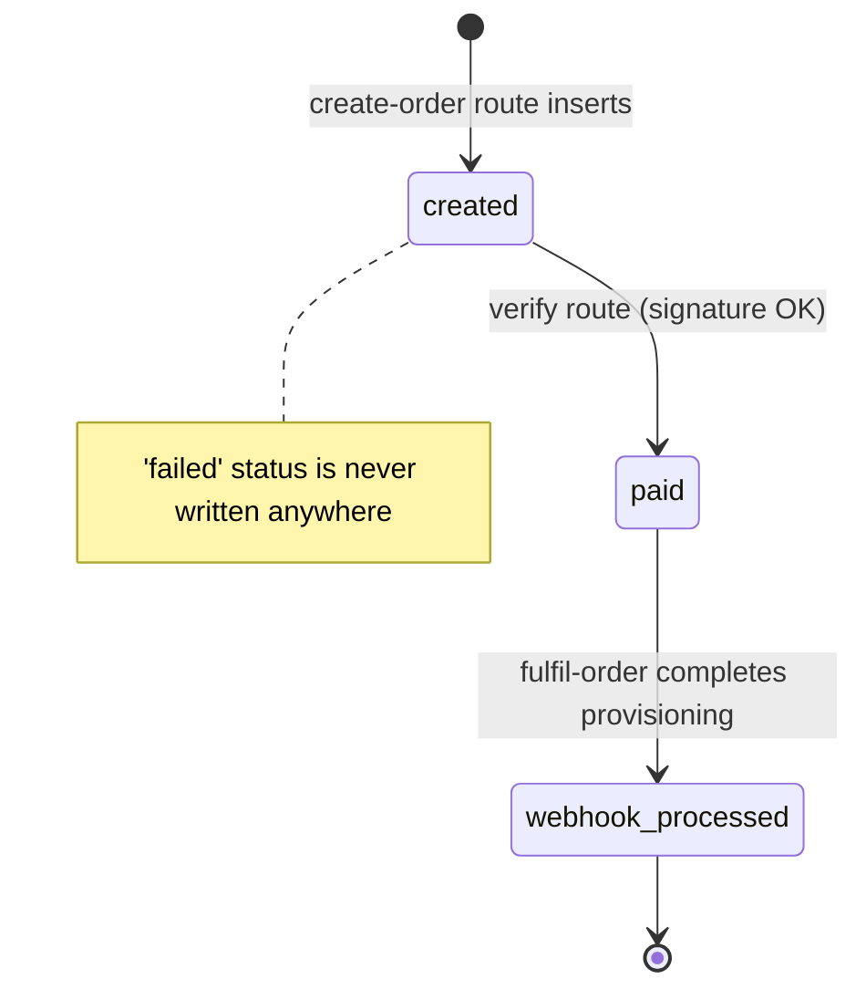
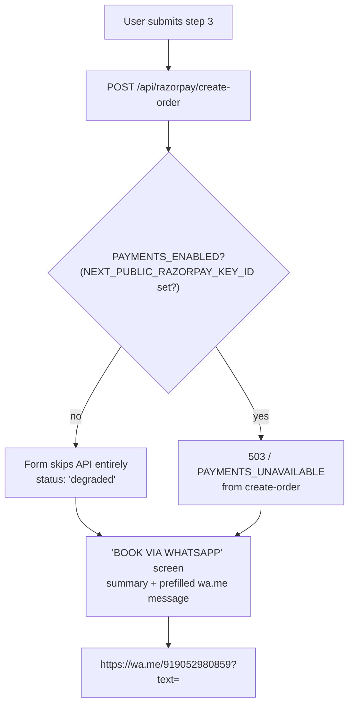
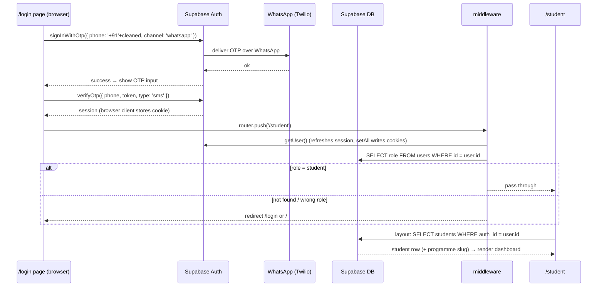
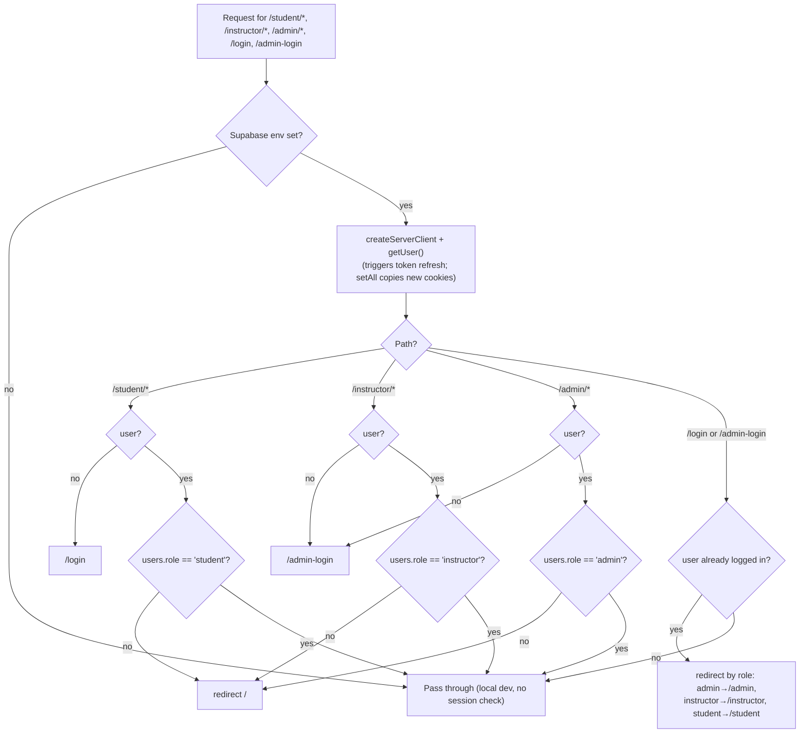
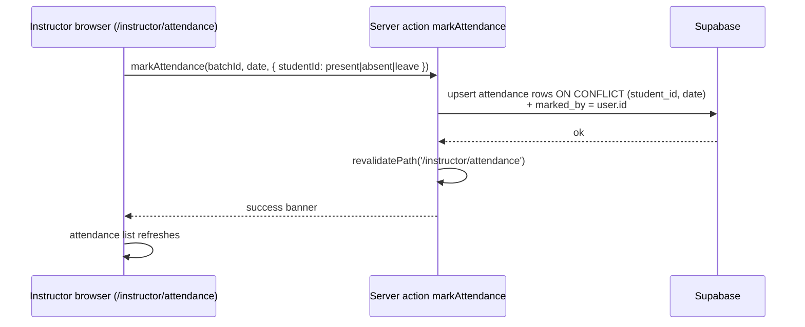
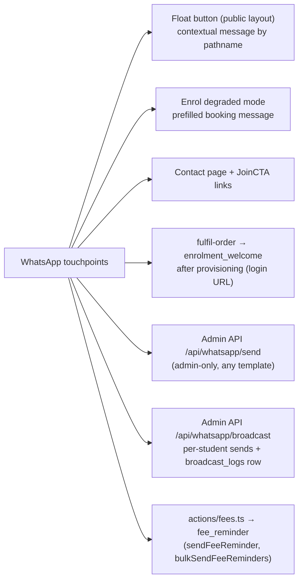

# Rhythmzz Academy of Dance — Application Flow & Architecture

**Branch:** `feat/rework-supabase-backend` · **Generated:** 25 Aug 2026

Exhaustive walkthrough of every flow in the app: public site, enrolment, payments, auth, WhatsApp, admin, instructor, student, realtime, and the data layer. Every claim carries a file reference — relative to the repo root.

---

## 1. Stack

| Layer | Tech |
|---|---|
| Framework | Next.js **16.3.2** (App Router, React 19.2.8) — note: this branch's Next has breaking changes vs. older versions |
| Styling | Tailwind CSS v4, `clsx`, `tailwind-merge`, `lucide-react` |
| Motion | GSAP 3.15.0 + `@gsap/react` 2.1.2 (ScrollTrigger) |
| Backend | Supabase (Postgres + Auth + Realtime), `@supabase/ssr` 0.12.4, `@supabase/supabase-js` 2.112.3 |
| Payments | Razorpay (Node SDK 2.9.8 server-side, checkout.js browser-side) |
| Validation | Zod 4 |
| Path alias | `@/*` → `./src/*` ([tsconfig.json](../tsconfig.json)) |

**Key config:** `next.config.ts` allows images from `*.supabase.co` and `images.unsplash.com`; no experimental flags. `build` runs with `--webpack` ([package.json](../package.json)).

---

## 2. System overview



Three Supabase clients exist, each with a distinct role ([src/lib/supabase/](../src/lib/supabase/)):

| Client | File | Key used | Used for |
|---|---|---|---|
| Browser | `client.ts` | anon (public) | login pages, realtime hook, OTP SDK calls |
| Server (cookie) | `server.ts` → `createServerSupabase()` | anon (public) | everything session-aware: pages, actions, API routes (~36 call sites) |
| Server (admin) | `server.ts` → `createAdminSupabase()` | **service role** | exactly one place: provisioning in [fulfill-order.ts](../src/lib/payments/fulfill-order.ts) |
| Public (stateless) | `public.ts` → `getPublicSupabase()` | anon (public) | `src/data/*` content fetchers; no cookies → SSG-safe |

---

## 3. Rendering model & the data layer

### Static vs dynamic

| Routes | Mode |
|---|---|
| Homepage, /programmes, /about, /contact, /gallery, /studio-rental, /blog, /login, /admin-login | Static (○) |
| /programmes/[slug], /blog/[slug] | SSG (●) via `generateStaticParams` |
| /enrol, /admin/*, /instructor/*, /student/* | Dynamic (ƒ) — dashboards are `force-dynamic` |
| /student/:path*, /instructor/:path*, /admin/:path*, /login, /admin-login | Middleware (proxy) |

### The live-vs-fallback pattern

Every public data fetcher follows the same shape: query Supabase with the stateless anon client; if the query **fails or returns empty**, silently return hardcoded defaults. This is what makes the site work both before the DB existed and while connected.



**Critical invariant:** fallback UUIDs mirror the seeded DB UUIDs (programmes `a1b2c3d4-4001…4004`, batches `a1b2c3d4-4101…4106`) so the enrol form can submit the same `programmeId`/`batchId` in both connected and disconnected modes ([src/data/batches.ts:3-4](../src/data/batches.ts), [setup.sql seed](../supabase/setup.sql)).

| Fetcher | File | Query | Fallback |
|---|---|---|---|
| `getProgrammes()` | [src/data/programmes.ts:54](../src/data/programmes.ts) | `programmes` (active, by sort_order) | 4 hardcoded programmes |
| `getProgrammeBySlug()` | [programmes.ts:67](../src/data/programmes.ts) | `programmes` + `batches` + `instructors` by slug | find in defaults |
| `getBatches()` | [src/data/batches.ts:80](../src/data/batches.ts) | `batches` (active) + joined programme/instructor | 6 hardcoded batches |
| `getInstructors()` | [src/data/instructors.ts:42](../src/data/instructors.ts) | `instructors` (active) | 4 hardcoded instructors |
| `getStats()` | [src/data/content.ts:33](../src/data/content.ts) | `site_content` where `content_key LIKE 'stats_%'` | `5000+ / 15+ / 4 / 3` |
| `getFAQs()` | [content.ts:47](../src/data/content.ts) | `site_content` key `faqs` (JSON array) | 7 SEO Q&As |
| `getTestimonials()` | [content.ts:73](../src/data/content.ts) | `site_content` key `testimonials` | 3 testimonials |
| `getBanner()` | [content.ts:60](../src/data/content.ts) | `site_content` key `banner` | `null` (banner hidden) |
| `getBlogPosts()` / `getBlogPostBySlug()` | [src/data/blog.ts](../src/data/blog.ts) | `blog_posts` (published) | 1 welcome post |
| `getGalleryImages(limit)` | [src/data/gallery.ts](../src/data/gallery.ts) | `gallery` (visible, by sort) | `[]` (empty) |

---

## 4. Database (Supabase)

`supabase/setup.sql` is the single source of truth — generated by [scripts/build-setup-sql.js](../scripts/build-setup-sql.js) from backup migrations + reference-corrected seed, made idempotent (DROP-before-CREATE for triggers/policies). Run `node scripts/build-setup-sql.js` to regenerate.

### Enums

`user_role (admin|instructor|student)` · `attendance_status (present|absent|leave)` · `payment_source (razorpay|cash|upi_offline)` · `batch_status (active|paused|full)` · `rental_status (pending|confirmed|cancelled)` · `gallery_type (photo|video)`

### Tables

| Table | Purpose | Notable columns |
|---|---|---|
| `users` | Profile row linked to Supabase Auth | `id` = `auth.users.id` (FK, cascade), `role` |
| `programmes` | The 4 dance programmes | `slug` unique, `fees_monthly`, `fees_quarterly`, `includes TEXT[]` |
| `instructors` | Instructors | `auth_id` → auth.users, `role` (patched in by the generator), `certifications TEXT[]` |
| `batches` | Class batches | `programme_id`, `instructor_id`, `days TEXT[]`, `time_start/end TIME`, `capacity`, `enrolled_count`, `status` |
| `students` | Enrolled students | `auth_id` → auth.users, `phone` unique, `programme_id`, `batch_id`, `student_id_display` (auto `RHY-####` via trigger), `status` |
| `attendance` | Daily per-student attendance | `UNIQUE(student_id, date)`, `status`, `marked_by` → instructors |
| `payment_orders` | Razorpay order ledger | `razorpay_order_id` unique, `amount`, `status` (plain TEXT: `created` → `paid` → `webhook_processed`), `webhook_payload` |
| `fee_payments` | Payment records | `amount`, `source` enum, `razorpay_payment_id`, `payment_order_id`, `receipt_url`, `paid_at` |
| `broadcast_logs` | WhatsApp/SMS broadcast log | `message`, `template_name`, `recipients JSONB`, `recipient_count`, `sent_by` |
| `studio_rentals` | Studio booking requests | name/phone, `preferred_date`, times, `status`, `admin_notes` |
| `gallery` | Media library | `url`, `type`, `tags`, `programme_id`, `is_visible` |
| `site_content` | CMS key-value store | `content_key` unique, `content_value JSONB` — keys: `stats_students/stats_years/stats_programmes/stats_awards`, `faqs`, `testimonials`, `banner` |
| `kuchipudi_progress` | Classical progress per student | `student_id` unique, `current_level`, `modules_completed`, `certificate_urls` |
| `blog_posts` | Blog | `slug` unique, `is_published`, `tags`, `author_id` |

### RLS matrix

RLS is enabled on all 14 tables. Helper `public.get_user_role()` is SECURITY DEFINER. Policy summary:

| Table | Public (anon/any user) | Instructor | Admin |
|---|---|---|---|
| `users` | SELECT own row | — | SELECT all |
| `programmes` | SELECT active | — | ALL |
| `batches` | SELECT non-paused | — | ALL |
| `instructors` | SELECT active | — | ALL |
| `students` | SELECT own (auth_id) | SELECT their batches' students | ALL |
| `attendance` | SELECT own | ALL on own batches | ALL |
| `fee_payments` | SELECT own | — | ALL |
| `payment_orders` | — | — | ALL |
| `broadcast_logs` | — | — | ALL |
| `studio_rentals` | INSERT (anon) | — | ALL |
| `gallery` | SELECT visible | — | ALL |
| `site_content` | SELECT all | — | ALL |
| `kuchipudi_progress` | SELECT own | SELECT their students | ALL |
| `blog_posts` | SELECT published | — | ALL |

> ⚠️ Observed tension (documented, not yet fixed): the anon-key routes (`create-order`, `verify`, `enrol`) write to `payment_orders`, which has **no** anon INSERT/UPDATE policy — only admin-ALL. The service-role path in fulfil-order is fully permitted.

### SQL functions (all SECURITY DEFINER)

| Function | Returns / does | Callers |
|---|---|---|
| `get_dashboard_analytics()` | `active_students`, `enrollments_this_month`, `enrollments_last_month`, `revenue_this_month`, `avg_attendance_this_week`, `batch_occupancy[]` | [admin/page.tsx](../src/app/admin/page.tsx) |
| `get_student_attendance_summary(student_id)` | `total_classes`, `present_count`, `absent_count`, `leave_count`, `percentage`, `last_30_days[]` | student dashboard + attendance page |
| `check_consecutive_absences(student_id, threshold)` | TRUE if last N rows all absent | none yet |
| `increment_batch_enrollment(batch_id)` | row-lock `FOR UPDATE`, raises `Batch is full` at capacity, flips status to `full` | [fulfill-order.ts:89](../src/lib/payments/fulfill-order.ts), [actions/students.ts:29](../src/actions/students.ts) |
| `decrement_batch_enrollment(batch_id)` | decrement (floor 0), un-flip `full` → `active` | [actions/students.ts:14](../src/actions/students.ts) |

---

## 5. Public site flow

### Chrome — [src/app/(public)/layout.tsx](../src/app/(public)/layout.tsx)

Single owner of all chrome (this fixed the old double-render bug):

1. Skip-to-content link
2. **Announcement banner** — async `BannerFetcher` awaits `getBanner()` inside its own `<Suspense fallback={null}>` so the DB fetch never blocks the route shell
3. `<Nav />` — fixed header (client)
4. `<main id="main">` wrapping `<GsapProvider>{children}</GsapProvider>` — provider registers ScrollTrigger once before any motion component mounts
5. `<Footer />`, `<WhatsappFloat />` (fixed bottom-right)

### Homepage — [src/app/(public)/page.tsx](../src/app/(public)/page.tsx)

Server component; fetches 7 data sources in one `Promise.all` (programmes, batches, instructors, gallery×8, stats, FAQs, testimonials), then renders: StructuredData → Hero → Marquee → Stats → Programmes → Schedule → Instructors → Testimonials → Gallery → JoinCTA → Studio-rental band → FAQ → Map/Contact. Section wrappers use `<Reveal>` (GSAP scroll-reveal); hero orbs use `<Parallax>`; stats use `<CountUp>` (final value is in the initial HTML — safe for no-JS/reduced-motion).



### Other public pages

| Page | Data | Notes |
|---|---|---|
| `/programmes` | `getProgrammes()` + `getBatches()` | ItemList JSON-LD; grid of ProgrammeCards with `scheduleFor()` |
| `/programmes/[slug]` | `getProgrammeBySlug()` + `getBatches()` | SSG; Course JSON-LD; `PROGRAMME_NOTES[slug]` copy map; fees sidebar; `notFound()` on missing |
| `/about` | `getInstructors()` | rest hardcoded (stats, timeline, awards) |
| `/contact` | none | pure static; constants from [src/lib/utils/constants.ts](../src/lib/utils/constants.ts) |
| `/gallery` | `getGalleryImages(100)` | ImageGallery JSON-LD; client filter + lightbox |
| `/studio-rental` | none | static copy + StudioRentalForm (see §12) |
| `/blog`, `/blog/[slug]` | `getBlogPosts()` / `getBlogPostBySlug()` | BlogPosting JSON-LD; `dangerouslySetInnerHTML` content |
| `sitemap.ts` / `robots.ts` | live Supabase for programme/blog URLs | robots disallows dashboards + `/api/` |

### SEO — [src/components/shared/structured-data.tsx](../src/components/shared/structured-data.tsx)

Homepage emits `DanceSchool` (address/geo/hours/founder/awards) + `OfferCatalog` (4 offers with fees) + `FAQPage` (7 Q&As) + `BreadcrumbList`. Per-page blocks: `ItemList` (/programmes), `Course` (programme detail), `BlogPosting` (blog), `ImageGallery` (/gallery).

### Loading / error / motion

- Skeletons: shared kit in [src/components/ui/skeleton.tsx](../src/components/ui/skeleton.tsx); `loading.tsx` on 6 surfaces sized to real components (CLS-safe).
- `error.tsx` on 4 surfaces + branded `not-found.tsx`. (Next 16.3 note: `error.tsx` is client-rendered only — the not-found UI streams as interim shell, then the error UI swaps in on hydration.)
- Motion gates on `prefersMotion()` = `!matchMedia('(prefers-reduced-motion: reduce)')` — every GSAP animation ([src/components/motion/](../src/components/motion/)). LCP elements (hero logo, H1) are never animated.

---

## 6. Enrolment + payments (the money path)

### The form — [src/components/public/enrol-form.tsx](../src/components/public/enrol-form.tsx)

Client component. `PAYMENTS_ENABLED = Boolean(process.env.NEXT_PUBLIC_RAZORPAY_KEY_ID)` — **this one env var switches the entire flow** between Razorpay and WhatsApp-booking mode.

3-step state machine (step 1 Programme → step 2 Batch → step 3 Details):

- Step 1: `<select>` of programmes; shows `fees_monthly`/`fees_quarterly`/`age_group`; changing programme clears batch.
- Step 2: `<select>` of batches filtered by programme; label like "Monday · Wednesday · 5:00 PM – 7:00 PM".
- Step 3: name, email (optional), phone; confirmation strip; Zod validation via `enrolFormSchema` (`name` 2-100, phone `/^[6-9]\d{9}$/`, programmeId/batchId UUIDs) — [src/lib/validators/enrol.ts](../src/lib/validators/enrol.ts).

`/enrol?programme=<slug>` preselects step 1 — used by every "Enrol Now"/"Book" link.

### Happy path (Razorpay configured)



**Why verify does the full provisioning** (not just verification): [verify/route.ts:35-37](../src/app/api/razorpay/verify/route.ts) — enrolment must work even when the webhook isn't configured (webhook needs a public URL, i.e. only after deploy).

### Webhook path — [src/app/api/razorpay/webhook/route.ts](../src/app/api/razorpay/webhook/route.ts)

Raw-body HMAC with `RAZORPAY_WEBHOOK_SECRET`; acts only on `payment.captured` / `order.paid`; resolves order id from the payload and calls the **same** `provisionStudentFromOrder` with the full payload stored on the order.

### The race & idempotency

Both verify and webhook can reach fulfil-order. The guard is `if (order.status === 'webhook_processed') return { fulfilled: true, alreadyProcessed: true }` ([fulfill-order.ts:42](../src/lib/payments/fulfill-order.ts)) — a read-then-write check (no DB lock), which dedupes sequential deliveries (verify first, webhook retry later). Notable edge cases:

- **Full batch**: `increment_batch_enrollment` raises → provisioning aborts **before** the terminal status write → order stays `paid` and a retry can re-run provisioning.
- **Insert failure**: if the student insert fails, fee/WhatsApp are skipped but the order is still marked `webhook_processed`.

### `payment_orders` status machine



### Degraded mode (no `NEXT_PUBLIC_RAZORPAY_KEY_ID`)



Also: if `checkout.js` fails to load, the form falls back to the same degraded screen ([enrol-form.tsx:142-146](../src/components/public/enrol-form.tsx)).

### Fee records & offline payments

- Online: `fee_payments` inserted only by fulfil-order (`source: 'razorpay'`).
- Offline: `logOfflinePayment` ([src/actions/fees.ts:7](../src/actions/fees.ts)) inserts with `source` `'cash'`/`'upi_offline'` — **exists but not wired to any UI yet**.
- `receipt_url` is rendered by the student payment-history component but never written anywhere.

---

## 7. Auth & sessions

### Student login — WhatsApp OTP (browser SDK path)

The login page calls Supabase Auth **directly from the browser** ([src/app/(auth)/login/page.tsx](../src/app/(auth)/login/page.tsx)) — the `/api/auth/otp/*` routes exist but are unused (dead code).



> ⚠️ Channel mismatch in the code: OTP is **sent** via `channel: 'whatsapp'` but **verified** with `type: 'sms'` ([login/page.tsx:31-57](../src/app/(auth)/login/page.tsx)).

### Admin login — email/password

[src/app/(auth)/admin-login/page.tsx](../src/app/(auth)/admin-login/page.tsx): `signInWithPassword({email, password})` → look up `users.role` → role `admin` → `/admin`, `instructor` → `/instructor`, anything else → signOut + "Access denied". (Supabase Auth user is created in the dashboard, then the commented `INSERT INTO public.users (id, role)` from setup.sql links it.)

### Middleware — the role guard — [src/middleware.ts](../src/middleware.ts)



Defense in depth: middleware (route-level) + dashboards' own layout checks (session + role row lookup) + RLS (data-level). API routes `/api/export`, `/api/whatsapp/*`, `/api/certificate` additionally check `users.role === 'admin'` manually.

Session refresh chain: middleware `getUser()` refreshes expired tokens and re-sets cookies; server components' `setAll` writes are swallowed (Server Components can't set cookies); the browser client persists its own session after login.

`/api/auth/callback` (PKCE): `exchangeCodeForSession(code)` → role lookup → redirect admin/instructor/student. (Present for email-link flows; the current login pages don't use it.)

---

## 8. Admin logic

Chrome: [src/app/admin/layout.tsx](../src/app/admin/layout.tsx) (`force-dynamic`) renders the sidebar; header shows a static "Admin User" label. No logout button in the admin sidebar.

### Dashboard — [src/app/admin/page.tsx](../src/app/admin/page.tsx)

`getAnalytics()` → `rpc('get_dashboard_analytics')` → `<AnalyticsCards>` (client) with realtime: subscribes to `students` INSERT via [src/hooks/use-realtime.ts](../src/hooks/use-realtime.ts) and increments local counters.

> ⚠️ Key mismatch: the component reads `monthly_enrolments` / `monthly_revenue` / `attendance_rate`, but the SQL function returns `enrollments_this_month` / `revenue_this_month` / `avg_attendance_this_week` — Revenue and Attendance cards currently render `NaN`.

### Admin subpages — wired vs unwired

| Page | Reads | Writes | Status |
|---|---|---|---|
| Students ([page](../src/app/admin/students/page.tsx), [table](../src/components/admin/student-table.tsx)) | `getStudentsAction` (keyset pagination, search, status filter) | — | ✅ live |
| Student detail ([page](../src/app/admin/students/[id]/page.tsx)) | student + programme + batch | Edit/Deactivate buttons | ⚠️ read-only; payments/enrolments sections are mock |
| Classes ([page](../src/app/admin/classes/page.tsx), [BatchManager](../src/components/admin/batch-manager.tsx)) | programmes + batches + instructors via actions | "New Batch"/"New Programme" buttons | ⚠️ read-only display |
| Attendance ([page](../src/app/admin/attendance/page.tsx)) | none | none | ⛔ placeholder ("under construction") |
| Fees ([page](../src/app/admin/fees/page.tsx), [FeeTable](../src/components/admin/fee-table.tsx)) | none | `logOfflinePayment` action exists | ⛔ mock table |
| Gallery ([GalleryManager](../src/components/admin/gallery-manager.tsx)) | none | `reorderMedia`/`toggleVisibility`/`deleteMedia` actions exist | ⛔ mock |
| Blog ([BlogEditor](../src/components/admin/blog-editor.tsx)) | none | `createPost`/`updatePost`/`deletePost` actions exist | ⛔ mock |
| Content ([ContentEditor](../src/components/admin/content-editor.tsx)) | none | `updateSiteContent`/`updateFAQ`/`updateBanner` actions exist | ⛔ mock |
| Instructors ([InstructorManager](../src/components/admin/instructor-manager.tsx)) | `getInstructorsAction()` | none | ⚠️ read-only cards |
| Studio Rental ([RentalCalendar](../src/components/admin/rental-calendar.tsx)) | none | `confirmRental`/`cancelRental` actions exist | ⛔ mock calendar |
| Broadcast ([BroadcastComposer](../src/components/admin/broadcast-composer.tsx)) | none | `sendBroadcast` action is a stub | ⛔ static form, "Estimated Reach: 0" |

**Takeaway:** the entire mutation layer exists as server actions ([src/actions/](../src/actions/)) but only the Students/Classes reads and the instructor attendance write are wired to UI today.

---

## 9. Instructor logic

[src/app/instructor/layout.tsx](../src/app/instructor/layout.tsx): `force-dynamic`; `getUser()` → no user → `/login`; then `instructors` by `auth_id` → no row → `/`. (Middleware additionally enforces role `instructor`.) Sidebar: Dashboard, My Classes, Mark Attendance, Students. Sign-out posts to `/auth/signout` — **route doesn't exist** (broken for instructor + student sidebars alike).

### Attendance marking (the one fully-wired write path)



- Attendance rows: `UNIQUE(student_id, date)`; statuses `present | absent | leave`.
- Instructor pages: dashboard (their batches + today's classes by day name, student counts), classes (batch cards + rosters), students (list with client search). All read-only.
- Instructor-side RLS scopes reads/writes to their own batches (`attendance_instructor_read_write`, students/kuchipudi_progress similar).

---

## 10. Student logic

[src/app/student/layout.tsx](../src/app/student/layout.tsx): `force-dynamic`; `getUser()` → no user → `/login`; `students` by `auth_id` → no row → `/`. Sidebar shows Progress only for Kuchipudi students (`programmes.slug === 'kuchipudi'`).

| Page | Data | Status notes |
|---|---|---|
| Dashboard | student + programme + batch; attendance % via `get_student_attendance_summary` | Fee card hardcoded "Paid" |
| Schedule | `students.batches(*)` → days/time grid | read-only |
| Attendance | `attendance` rows + summary RPC | ⚠️ reads `present_classes` but RPC returns `present_count` → present always 0, absent math wrong |
| Fees | `fee_payments` ordered by `paid_at`; "Paid" iff latest payment is this month; due on the 5th; amount = `fees_monthly || 2500` | "Pay Now" button alerts "Razorpay integration pending" |
| Notices | `broadcast_logs` latest 20 | ⚠️ no recipient filtering — every student sees all broadcasts |
| Progress | `kuchipudi_progress` (single row) | non-Kuchipudi → redirect `/student` |

---

## 11. WhatsApp logic

### Provider layer — [src/lib/whatsapp/client.ts](../src/lib/whatsapp/client.ts)

`sendWhatsAppTemplate({ phone, templateName, variables })` dispatches on `WHATSAPP_PROVIDER` (default `interakt`):

- **Interakt** — POST `WHATSAPP_API_URL` (default `https://api.interakt.ai/v1/public/message/`), Basic auth `base64(apiKey + ':')`, body `{ phoneNumber, type: 'template', template: { name, languageCode: 'en', bodyValues } }` (variables → positional array).
- **WATI** — POST `{WHATSAPP_API_URL}/api/v2/sendTemplateMessage?whatsappNumber=…`, Bearer token, named `parameters`.
- **Unknown provider** → mock log, `{ success: true }`.
- Phone normalization: strip non-digits, force `91` prefix.

Templates ([src/lib/whatsapp/templates.ts](../src/lib/whatsapp/templates.ts)): `welcome` (enrolment_welcome) · `paymentReceipt` · `feeReminder` · `absenceCheckIn` · `broadcast` (admin_broadcast) · `rentalConfirmed` · `certificateReady` · `scheduleChange`.

### Every WhatsApp touchpoint



- **Float** ([whatsapp-float.tsx](../src/components/public/whatsapp-float.tsx)): `usePathname()` picks the message — `/enrol` → "trying to book a class", `/programmes*` → "know more about a programme", else generic.
- **Broadcast** ([src/app/api/whatsapp/broadcast/route.ts](../src/app/api/whatsapp/broadcast/route.ts)): admin-only; selects active `students` (optionally filtered by programme/batch), loops template sends with `student_name`, then inserts a `broadcast_logs` row. That row is what the student Notices page later reads.
- **Unused templates so far**: `paymentReceipt`, `absenceCheckIn`, `rentalConfirmed`, `certificateReady`, `scheduleChange` — defined, no callers.

---

## 12. Studio rental flow (current state)

- Public page is static copy; [StudioRentalForm](../src/components/public/studio-rental-form.tsx) **simulates** submission (1s `setTimeout`, success card, "Submitting this form does not confirm your booking").
- The real API route `POST /api/studio-rental` (Zod-validated insert into `studio_rentals` status `pending`) **exists but the form never calls it**.
- Admin `RentalCalendar` is a placeholder; `confirmRental`/`cancelRental` actions exist but are unwired. `rental_confirmed` template defined but never sent.
- RLS does allow anon INSERT on `studio_rentals` — the plumbing is ready, the wiring is not.

---

## 13. Realtime

- Publication: `supabase_realtime` carries `attendance`, `fee_payments`, `studio_rentals` ([setup.sql](../supabase/setup.sql)).
- Only consumer today: admin dashboard `AnalyticsCards` subscribing to `students` INSERT (via generic [use-realtime.ts](../src/hooks/use-realtime.ts) hook with channel cleanup).
- No dashboards yet subscribe to attendance/fee_payments/studio_rentals — the publication is ahead of the UI.

---

## 14. Environment config

| Var | Used by |
|---|---|
| `NEXT_PUBLIC_SUPABASE_URL` / `NEXT_PUBLIC_SUPABASE_ANON_KEY` | all Supabase clients; middleware env gate |
| `SUPABASE_SERVICE_ROLE_KEY` | `createAdminSupabase()` — fulfil-order only |
| `RAZORPAY_KEY_ID` / `RAZORPAY_KEY_SECRET` | server order creation + signature verification |
| `NEXT_PUBLIC_RAZORPAY_KEY_ID` | gates the whole enrol flow (PAYMENTS_ENABLED) + footer badge |
| `RAZORPAY_WEBHOOK_SECRET` | webhook signature (only needed once deployed) |
| `WHATSAPP_PROVIDER` / `WHATSAPP_API_KEY` / `WHATSAPP_API_URL` | Interakt (default) or WATI template sends |
| `NEXT_PUBLIC_APP_URL` | declared in example env, not referenced in code |

Current `.env.local` (gitignored) holds only the three Supabase keys — so the site runs the **degraded WhatsApp-booking enrolment** until Razorpay keys land.

---

## 15. Known gaps & observations (research findings)

These are factual observations from tracing the code — the mutation layer and API surface exist, but several edges are unwired or drift from their contracts:

1. **`/api/enrol` and `actions/enrol.ts` are dead code** — the public form posts to `/api/razorpay/create-order` directly; the parallel enrol route/action have no callers.
2. **OTP routes dead** — `/api/auth/otp/send` and `/verify` have no callers (login uses browser SDK). In them, send uses `channel: 'whatsapp'`, verify uses `type: 'sms'` — a mismatch also present in the live login page.
3. **Sign-out broken** — student/instructor sidebars post to `/auth/signout`, which doesn't exist.
4. **Analytics keys mismatch** — `AnalyticsCards` reads `monthly_enrolments`/`monthly_revenue`/`attendance_rate`; the RPC returns `enrollments_this_month`/`revenue_this_month`/`avg_attendance_this_week` → NaN on Revenue/Attendance cards.
5. **Attendance page key mismatch** — reads `present_classes`, RPC returns `present_count` → present always shows 0.
6. **Admin UI largely unwired** — Attendance/Fees/Gallery/Blog/Content/Studio Rental/Broadcast pages are mock shells; their server actions exist with zero callers.
7. **`payment_orders` anon writes vs RLS** — create-order/verify write via the anon client but the table has only an admin-ALL policy.
8. **Notices unfiltered** — every student sees all `broadcast_logs` (no recipient scoping).
9. **`receipt_url` never written** — rendered in student payment history, no producer.
10. **`decrement_batch_enrollment`** is called (deactivate) but nothing in the UI triggers deactivate; `check_consecutive_absences` + `absence_checkin` template have no callers.
11. **Studio-rental public form** never calls its API route (simulated submission).
12. **`failed` payment status** is never written — abandoned orders stay `created` forever.
13. **Fulfil-order guard is read-then-write** — dedupes sequential deliveries, not true concurrent races (documented, acceptable while the webhook retries after verify completes).

---

## 16. Running the app

```bash
npm install
npm run dev           # dev server
npm run build         # production build (--webpack)
npm start -- -p 3010  # production server on 3010 (3000-3002 busy with other services)
```

DB setup: `supabase/setup.sql` is idempotent — run it in the Supabase SQL Editor (or via `psql`/the pooler). Regenerate with `node scripts/build-setup-sql.js`. Lint (Next 16.3 removed `next lint`): `npx eslint <paths…>`.
